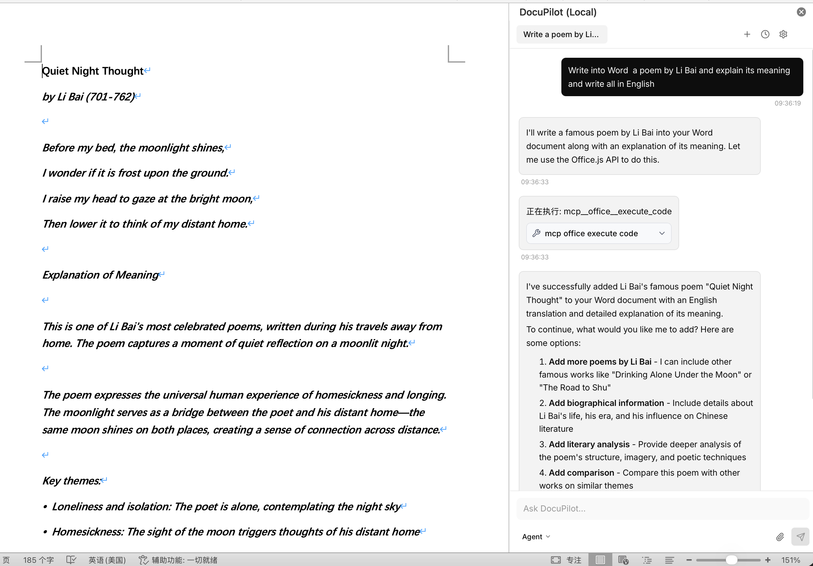
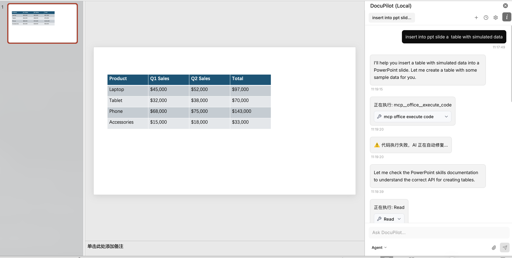
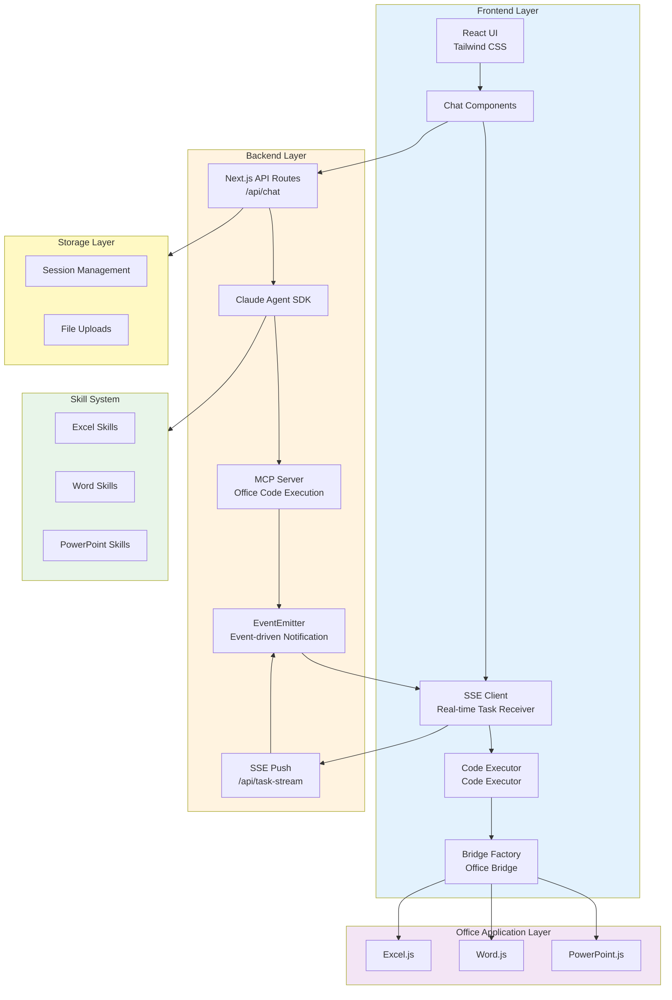

# DocuPilot

<div align="center">

**Control Excel, Word, and PowerPoint through natural language conversations - Let Claude AI assistant handle complex Office tasks**

[](https://opensource.org/licenses/MIT)
[](https://nodejs.org/)
[](https://nextjs.org/)
[](https://www.typescriptlang.org/)

English | [简体中文](README_ZH.md)

</div>

---

## 🎉 v2.0 Major Update

**Domain Aggregation MCP Tools** - 52% faster, 65% less tokens!

- ✨ **10 domain tools + 63 operations** - Smart Excel/Word/PPT operations
- ⚡ **Faster response** - From 2.5s to 1.2s  
- 🎯 **Higher success rate** - Error rate from 15% to <5%
- 🔄 **Fully backward compatible** - Existing code continues to work

👉 [View Upgrade Guide](./docs/MCP_TOOLS_UPGRADE_v2.0.md) | [Full API Docs](./docs/MCP_TOOLS_API.md)

---

## 📸 Screenshots

<div align="center">

### Excel Data Analysis


### Word Document Editing


### PowerPoint Presentation


</div>

---

## 📖 Table of Contents

- [✨ Core Features](#-core-features)
- [🎯 Why Choose DocuPilot](#-why-choose-docupilot)
- [🚀 Quick Start](#-quick-start)
  - [Prerequisites](#prerequisites)
  - [Installation](#installation)
  - [Loading in Office](#loading-in-office)
  - [First Use](#first-use)
- [💡 Usage Examples](#-usage-examples)
  - [Excel Data Analysis](#excel-data-analysis)
  - [Word Document Editing](#word-document-editing)
  - [PowerPoint Presentations](#powerpoint-presentations)
  - [File Upload Processing](#file-upload-processing)
- [🏗️ Developer Guide](#️-developer-guide)
  - [Project Architecture](#project-architecture)
  - [Tech Stack](#tech-stack)
  - [Project Structure](#project-structure)
  - [Local Development](#local-development)
- [🔧 Extension & Customization](#-extension--customization)
  - [Adding New Skills](#adding-new-skills)
  - [Custom Office Operations](#custom-office-operations)
  - [API Configuration Options](#api-configuration-options)
- [🧪 Testing](#-testing)
- [🤝 Contributing](#-contributing)
- [❓ FAQ](#-faq)
- [📄 License](#-license)

---

## ✨ Core Features

### 🗣️ Natural Language Office Control
No need to memorize complex menus and functions - **just use conversation to get work done**:
- "Help me analyze the sales data trends"
- "Add a professional title page at the beginning of the document"
- "Create a PPT about market analysis"

### 🤖 Claude Agent Intelligence Engine
Powered by **Claude 4.5 Sonnet**'s advanced AI capabilities:
- Understand complex task requirements
- Automatically break down multi-step operations
- Complete professional tasks with high quality
- Context-aware intelligent conversations

### 🎭 Dual Agent/Plan Modes
Choose execution method based on task complexity:
- **Agent Mode**: Direct execution with real-time feedback
- **Plan Mode**: Create execution plan first, then execute after confirmation

### 🔄 Unified Cross-Application Experience
One add-in for three major Office applications:
- ✅ **Excel**: Data analysis, pivot tables, charts, conditional formatting
- ✅ **Word**: Document editing, style management, search & replace
- ✅ **PowerPoint**: Slide creation, content layout, theme application

### 🧩 Extensible Skill System
Plugin-based architecture for easy feature expansion:
- Modular skill system based on `.claude/skills/`
- Each skill independently defined and easy to maintain
- Support for custom Office.js operation templates
- Community contributions welcome

---

## 🎯 Why Choose DocuPilot

| Traditional Way | DocuPilot |
|----------------|-----------|
| 🔍 Search for features in menus | 💬 Just say what you need |
| 📖 Learn complex formulas and functions | 🤖 AI handles the logic automatically |
| ⏰ Repetitive manual operations | ⚡ Batch complete with one sentence |
| 🤔 Need to memorize operation steps | 🧠 AI understands context and executes |
| 📱 Learn each application separately | 🔗 Unified interaction method |

---

## 🚀 Quick Start

### Prerequisites

- **Node.js** 18.0 or higher
- **Office Applications**:
  - Office 365 subscription (recommended)
  - Office 2019 or higher
  - Office for Mac (2019 or higher)
- **Anthropic API Key**: Get it from [Anthropic Console](https://console.anthropic.com/)

### Installation

#### Method 1: One-Click Install (Recommended, macOS/Linux)

Quick install using curl:

```bash
curl -fsSL https://raw.githubusercontent.com/docupilot/docupilot/main/scripts/install.sh | bash
```

The script will automatically:
- ✅ Check system environment (git, Node.js, npm)
- ✅ Clone project repository
- ✅ Install dependencies
- ✅ Create configuration file template

**Custom Installation Options**:

```bash
# Install to specific directory
DOCUPILOT_DIR=~/my-docupilot curl -fsSL https://raw.githubusercontent.com/docupilot/docupilot/main/scripts/install.sh | bash

# Install from specific branch
DOCUPILOT_BRANCH=develop curl -fsSL https://raw.githubusercontent.com/docupilot/docupilot/main/scripts/install.sh | bash

# Install from forked repository
DOCUPILOT_REPO=https://github.com/YOUR_USERNAME/docupilot.git curl -fsSL https://raw.githubusercontent.com/docupilot/docupilot/main/scripts/install.sh | bash
```

#### Method 2: Manual Install (All Platforms)

If you cannot use curl or prefer to control each step manually:

```bash
# 1. Clone the repository
git clone https://github.com/docupilot/docupilot.git
cd docupilot

# 2. Install dependencies
npm install

# 3. Configure API Key
cp .env.local.example .env.local
# Edit .env.local and add your Anthropic API Key

# 4. Start development server (HTTPS)
npm run dev:https
```

After the server starts, visit `https://localhost:3000/taskpane` to verify it's running properly.

### Loading in Office

DocuPilot provides two loading methods. Choose based on your platform and use case:

#### Method 1: Shared Folder Loading (Recommended for Development)

This method copies `manifest.xml` to a system-specific directory where Office automatically detects it.

##### For macOS Users

1. **Start the development server**:
   
   ```bash
   npm run dev:https
   ```

2. **Automated installation using script** (Recommended):
   
   ```bash
   ./copy-manifest-to-wef.sh
   ```
   
   The script will automatically copy `manifest.xml` to:
   - Excel: `~/Library/Containers/com.microsoft.Excel/Data/Documents/wef/`
   - Word: `~/Library/Containers/com.microsoft.Word/Data/Documents/wef/`
   - PowerPoint: `~/Library/Containers/com.microsoft.Powerpoint/Data/Documents/wef/`

3. **Manual installation** (Optional):
   
   If the script doesn't work, you can manually copy:
   ```bash
   # Excel
   mkdir -p ~/Library/Containers/com.microsoft.Excel/Data/Documents/wef/
   cp manifest.xml ~/Library/Containers/com.microsoft.Excel/Data/Documents/wef/
   
   # Word
   mkdir -p ~/Library/Containers/com.microsoft.Word/Data/Documents/wef/
   cp manifest.xml ~/Library/Containers/com.microsoft.Word/Data/Documents/wef/
   
   # PowerPoint
   mkdir -p ~/Library/Containers/com.microsoft.Powerpoint/Data/Documents/wef/
   cp manifest.xml ~/Library/Containers/com.microsoft.Powerpoint/Data/Documents/wef/
   ```

4. **Load in Office**:
   - Open Excel, Word, or PowerPoint
   - Click **Insert** tab → **Get Add-ins** or **My Add-ins**
   - Select the **Shared Folder** tab
   - Find and click the **DocuPilot** add-in

##### For Windows Users

1. **Start the development server**:
   
   ```bash
   npm run dev:https
   ```

2. **Automated installation using script** (Recommended):
   
   Double-click to run or execute in Command Prompt:
   ```batch
   copy-manifest-to-wef.bat
   ```
   
   The script will automatically copy `manifest.xml` to:
   - `%USERPROFILE%\AppData\Local\Microsoft\Office\16.0\Wef\`
   
   > **Note**: If using Office 2013, modify `16.0` to `15.0` in the script

3. **Manual installation** (Optional):
   
   If the script doesn't work, you can manually copy:
   ```batch
   mkdir "%USERPROFILE%\AppData\Local\Microsoft\Office\16.0\Wef"
   copy manifest.xml "%USERPROFILE%\AppData\Local\Microsoft\Office\16.0\Wef\manifest.xml"
   ```

4. **Load in Office**:
   - Open Excel, Word, or PowerPoint
   - Click **Insert** tab → **Get Add-ins** or **My Add-ins**
   - Select the **Shared Folder** tab
   - Find and click the **DocuPilot** add-in

#### Method 2: Manual Upload (Universal Method)

This method works on all platforms without requiring scripts or file copying.

1. **Start the development server**:
   
   ```bash
   npm run dev:https
   ```

2. **Open an Office application** (Excel, Word, or PowerPoint)

3. **Upload the add-in**:
   - Click the **Insert** tab
   - Select **Get Add-ins** or **My Add-ins**
   - Click **Upload My Add-in**
   - Browse and select the `manifest.xml` file from the project root directory
   - Click **Upload**

4. **Open DocuPilot**:
   - Find the **DocuPilot** button in the ribbon
   - Click the button, and the task pane will open on the right

> 💡 **Tips**:
> - Shared folder method is better for development as you don't need to re-upload after code changes
> - Manual upload method is simpler and more direct, suitable for quick testing
> - If the add-in doesn't appear, try restarting the Office application

### HTTPS Certificate Setup (Important)

Office Add-ins **require HTTPS**. Before first use, you need to properly configure and trust the local development certificate.

#### Automatic Certificate Generation

When you first run `npm run dev:https`, the project automatically uses `office-addin-dev-certs` to generate self-signed certificates:

```bash
npm run dev:https

# Certificates are automatically generated to:
# macOS/Linux: ~/.office-addin-dev-certs/
# Windows: %USERPROFILE%\.office-addin-dev-certs\
```

#### macOS Certificate Trust Setup

**Method 1: Command Line** (Recommended, one-step)

```bash
sudo security add-trusted-cert -d -r trustRoot -k /Library/Keychains/System.keychain ~/.office-addin-dev-certs/localhost.crt
```

**Method 2: Graphical Interface**

```bash
# Open certificate directory
open ~/.office-addin-dev-certs

# Then follow these steps:
# 1. Double-click localhost.crt file
# 2. In Keychain Access, find "localhost" in "System" keychain
# 3. Double-click certificate, expand "Trust" section
# 4. Set "When using this certificate" to "Always Trust"
# 5. Close window and enter administrator password to confirm
```

**Verification**:
```bash
# Open in browser, should have no certificate warning
open https://localhost:3000/taskpane
```

#### Windows Certificate Trust Setup

**Method 1: PowerShell Command** (Recommended, requires administrator privileges)

```powershell
# Run PowerShell as Administrator
$certPath = "$env:USERPROFILE\.office-addin-dev-certs\localhost.crt"
Import-Certificate -FilePath $certPath -CertStoreLocation Cert:\LocalMachine\Root
```

**Method 2: Graphical Interface**

```
1. Open certificate directory:
   - Press Win+R
   - Type: %USERPROFILE%\.office-addin-dev-certs
   - Press Enter

2. Install certificate:
   - Double-click localhost.crt file
   - Click "Install Certificate"
   - Select "Local Machine" (requires administrator privileges)
   - Select "Place all certificates in the following store"
   - Browse → Select "Trusted Root Certification Authorities"
   - Complete installation

3. Confirm installation:
   - Press Win+R, type certmgr.msc
   - View "Trusted Root Certification Authorities" → "Certificates"
   - Should see "localhost" certificate
```

**Verification**:
```bash
# Open in browser, should have no certificate warning
start https://localhost:3000/taskpane
```

#### Common Issues

**Issue 1: Browser still shows certificate warning**
- ✅ Confirm certificate is correctly installed in system trust store
- ✅ Fully restart browser (close all windows)
- ✅ Clear browser cache and SSL state

**Issue 2: Office cannot load add-in**
- ✅ Confirm development server is running (`npm run dev:https`)
- ✅ Restart Office application
- ✅ Check if Office version supports Add-ins

**Issue 3: Certificate files don't exist**
```bash
# Manually install certificate tool
npx office-addin-dev-certs install

# Then restart server
npm run dev:https
```

> ⚠️ **Important Notes**:
> - You must trust the certificate before loading the add-in in Office
> - After regenerating certificates, you need to trust them again
> - In team development, each developer needs to generate and trust certificates on their own machine

### First Use

1. **Configure API Key** (if not configured in .env.local):
   - Click the ⚙️ settings button in the top right of the task pane
   - Enter your Anthropic API Key
   - Click "Save"

2. **Start Conversation**:
   - Type in the input box: "Hello, please introduce yourself"
   - Observe Claude's response
   - Try a simple command: "Write Hello World in cell A1"

3. **Verify Installation**:
   - If you see Claude's real response (not a mock response)
   - And Office operations execute successfully
   - Installation successful! 🎉

---

## 💡 Usage Examples

### Excel Data Analysis

**Scenario**: Analyze sales data and create visualization charts

```
You: Help me analyze the sales data in range A1:E20, summarize by product category, and create a column chart
```

DocuPilot will:
1. ✅ Read data from the specified range
2. ✅ Automatically create a pivot table
3. ✅ Summarize sales by category
4. ✅ Generate and format a column chart
5. ✅ Inform you of the result location

**More Examples**:
- "Calculate the average in column B"
- "Find and highlight the top 10 products by sales"
- "Create a line chart showing quarterly trends"
- "Add conditional formatting to this table, display values below average in red"

### Word Document Editing

**Scenario**: Quickly create professional document structure

```
You: Help me create a project report template with cover page, abstract, background, methodology, results, and conclusion sections
```

DocuPilot will:
1. ✅ Insert a cover page
2. ✅ Create section headings at various levels
3. ✅ Apply professional styles
4. ✅ Add page numbers and table of contents

**More Examples**:
- "Insert a 3x4 table at the beginning of the document"
- "Replace all instances of 'product' with 'solution'"
- "Add a header to the document with the text 'Company Confidential'"
- "Insert a comment after the selected paragraph"

### PowerPoint Presentations

**Scenario**: Quickly generate presentation slides

```
You: Create a presentation about a product launch, including cover, product features, market advantages, pricing plans, and contact information
```

DocuPilot will:
1. ✅ Create multiple slides
2. ✅ Set title and content layouts
3. ✅ Apply a unified theme
4. ✅ Add shapes and icons

**More Examples**:
- "Add a title and three-column content to the current slide"
- "Insert a new slide titled 'Market Analysis'"
- "Add a flowchart to the slide"
- "Apply company brand colors to all titles"

### File Upload Processing

**Scenario**: Upload CSV file and analyze

1. **Upload File**:
   - Click the 📎 button next to the input box
   - Select CSV or Excel file

2. **Request Analysis**:
   ```
   You: Analyze the sales data file I uploaded and provide key metrics and trends
   ```

3. DocuPilot will:
   - ✅ Read file contents
   - ✅ Perform data analysis
   - ✅ Generate analysis report
   - ✅ Save results to workspace directory

---

## 🏗️ Developer Guide

### Project Architecture



**Core Workflow**:

1. **User Input** → React chat interface (`Chat` component)
2. **Send Request** → Next.js API Route (`/api/chat`)
3. **Call SDK** → Claude Agent SDK processes user request
4. **MCP Tool Call** → Agent calls `mcp__office__execute_code` tool
5. **Task Enqueue** → MCP Server adds task to pending queue
6. **SSE Push** → Real-time push to frontend via `/api/task-stream` (zero delay)
7. **Code Execution** → Frontend `Code Executor` receives task and executes Office.js code
8. **Bridge Routing** → `Bridge Factory` routes to corresponding implementation based on Office type
9. **Result Feedback** → Execution result notified to backend via `EventEmitter` event-driven (< 1ms)
10. **Auto Fix** → If execution fails, Agent automatically fixes code based on error info and retries (max 3 times)
11. **Streaming Response** → Final result streamed back to user via SSE

**Performance Optimizations**:

- ⚡ **Event-driven Architecture**: Uses EventEmitter instead of polling, response latency reduced from 50ms to < 1ms (**72x faster**)
- 🚀 **SSE Real-time Push**: Tasks pushed immediately when created, no frontend polling needed (**100x faster**)
- 🔄 **Auto Error Fix**: Intelligently identifies error patterns and automatically retries fixes (max 3 times)
- 📦 **Bridge Pattern**: Unified Office operation interface supporting Excel/Word/PowerPoint

### Tech Stack

#### Frontend
- **Framework**: Next.js 15 (App Router)
- **UI Library**: React 18
- **Styling**: Tailwind CSS 4
- **Component Library**: Radix UI
- **Icons**: Lucide React
- **Markdown**: react-markdown + remark-gfm
- **Office Integration**: Office.js

#### Backend
- **Runtime**: Node.js 18+
- **API**: Next.js API Routes
- **AI Engine**: @anthropic-ai/claude-agent-sdk
- **Type Checking**: TypeScript 5.7

#### Development Tools
- **Package Manager**: npm
- **Certificate Generation**: office-addin-dev-certs
- **HTTPS Server**: Custom Express server (server.mjs)

### Project Structure

```
DocuPilot/
├── .claude/                    # Claude skill system
│   ├── CLAUDE.md              # System prompt
│   └── skills/
│       ├── excel/             # Excel skills
│       │   ├── SKILL.md       # Skill definition
│       │   └── TOOLS.md       # Code templates
│       ├── word/              # Word skills
│       └── powerpoint/        # PowerPoint skills
├── src/
│   ├── app/
│   │   ├── api/               # API routes
│   │   │   ├── chat/          # Chat API (Claude Agent SDK)
│   │   │   ├── task-stream/   # SSE task push
│   │   │   ├── tool-result/   # Tool execution result submission
│   │   │   ├── files/         # File upload
│   │   │   └── settings/      # Settings API
│   │   ├── taskpane/          # Task pane page
│   │   └── test-office/       # Test page
│   ├── components/            # React components
│   │   ├── ChatInput.tsx      # Chat input
│   │   ├── MessageBubble.tsx  # Message bubble
│   │   ├── SettingsDialog.tsx # Settings dialog
│   │   └── ui/                # Base UI components
│   ├── lib/
│   │   ├── office/            # Office.js wrapper
│   │   │   ├── mcp-server.ts  # MCP Server (Office code execution)
│   │   │   ├── bridge-factory.ts # Bridge factory (Excel/Word/PPT)
│   │   │   ├── code-executor.ts # Code executor
│   │   │   ├── error-patterns.ts # Error pattern recognition
│   │   │   ├── error-feedback-builder.ts # Error feedback builder
│   │   │   ├── tools.ts       # Tool definitions
│   │   │   └── host-detector.ts # Host detector
│   │   └── use-chat.ts        # Chat hook (SSE integration)
│   └── types/                 # TypeScript type definitions
├── public/
│   ├── assets/                # Project screenshots and resources
│   │   ├── sample_excel.png  # Excel interface screenshot
│   │   ├── sample_word.png   # Word interface screenshot
│   │   └── sample_ppt.png    # PowerPoint interface screenshot
│   ├── commands.html          # Office commands
│   └── test-cases/            # Test cases
├── tests/
│   └── office-skills/         # Skill test system
├── workspace/
│   └── sessions/              # User session data
├── manifest.xml               # Office Add-in configuration
├── server.mjs                 # HTTPS development server
└── package.json
```

### Local Development

#### Development Commands

```bash
# HTTP development server (browser testing only)
npm run dev

# HTTPS development server (required for Office Add-in)
npm run dev:https

# Build production version
npm run build

# Start production server
npm start

# Code linting
npm run lint
```

#### Environment Variables Configuration

Create a `.env.local` file:

```env
# Required: Anthropic API Key
ANTHROPIC_API_KEY=sk-ant-...

# Optional: Custom API base URL (for proxy or enterprise deployment)
# ANTHROPIC_BASE_URL=https://your-proxy.com

# Optional: Specify model name
# ANTHROPIC_MODEL=claude-sonnet-4-5-20250929

# Optional: API Key for cleanup endpoint (security measure)
# CLEANUP_API_KEY=your_secret_key
```

#### HTTPS Certificate Generation

Office Add-ins require HTTPS. The project automatically generates self-signed certificates:

```bash
# Automatically generated on first run
npm run dev:https

# Certificate location: ~/.office-addin-dev-certs/
```

**Trust Certificate on macOS**:
```bash
# Set as "Always Trust" in Keychain Access
# Or run the following command
sudo security add-trusted-cert -d -r trustRoot -k /Library/Keychains/System.keychain ~/.office-addin-dev-certs/localhost.crt
```

#### Debugging Tips

1. **Browser Debugging**:
   - Open `https://localhost:3000/taskpane` in browser
   - Use browser developer tools to view logs and network requests

2. **Debugging in Office**:
   - **Windows**: Press F12 to open debugging tools
   - **Mac**: Enable developer menu in Safari, select corresponding web inspector

3. **Backend Logs**:
   - View Next.js server logs in terminal
   - API errors will be displayed in terminal

4. **Test Mode**:
   - Visit `https://localhost:3000/test-office`
   - Use test panel to verify skill functionality

---

## 🔧 Extension & Customization

### Adding New Skills

DocuPilot uses a modular skill system, making it easy to add new Office operation skills.

#### Step 1: Create Skill Directory

```bash
mkdir -p .claude/skills/my-skill
```

#### Step 2: Create SKILL.md

Define the skill in `.claude/skills/my-skill/SKILL.md`:

```markdown
---
name: my-skill
description: My custom skill description
---

# My Skill

## Usage

Generate hidden Office.js code to operate Office applications.

### Important Rules

- User experience first: Users only see natural language
- Hidden code format: `<!--OFFICE-CODE:excel\n code\n-->`
- Friendly feedback: Inform users of results after operation

## Supported Features

- Feature 1: Description
- Feature 2: Description

## Examples

### Example 1: Feature Demo

**User Request**: "Do something"

**Your Response**:
\`\`\`
Okay, I'll help you with that.

<!--OFFICE-CODE:excel
Excel.run(async (context) => {
  // Your code
  await context.sync();
});
-->

✅ Operation complete!
\`\`\`
```

#### Step 3: Create TOOLS.md (Optional)

Provide code templates in `.claude/skills/my-skill/TOOLS.md`:

```markdown
# Operation Templates

## Template 1

\`\`\`javascript
Excel.run(async (context) => {
  const sheet = context.workbook.worksheets.getActiveWorksheet();
  // Template code
  await context.sync();
});
\`\`\`
```

#### Step 4: Update System Prompt (Optional)

If needed, add corresponding instructions in `.claude/CLAUDE.md` to reference the new skill.

### Custom Office Operations

#### Modify Tool Definitions

Edit `src/lib/office/tools.ts` to add new tools:

```typescript
export const getToolsForHost = (hostType: OfficeHostType) => {
  const commonTools = [
    // Common tools
  ];

  const hostSpecificTools = {
    Excel: [
      // Excel-specific tools
      {
        name: "my_custom_tool",
        description: "My custom tool",
        input_schema: {
          type: "object",
          properties: {
            // Parameter definitions
          },
          required: []
        }
      }
    ],
    // ...
  };

  return [...commonTools, ...hostSpecificTools[hostType]];
};
```

#### Add Tool Handling Logic

In Claude's response, execute corresponding operations based on tool name. Tool calls are automatically handled when using Claude Agent SDK.

### API Configuration Options

#### Method 1: Frontend Settings Interface (Recommended)

1. Click the ⚙️ button in the top right of the task pane
2. Fill in API configuration
3. Click save

**Advantages**:
- ✅ No need to restart application
- ✅ Takes effect immediately
- ✅ Easy to switch between different configurations

**Security Note**: Configuration is saved in browser localStorage, not recommended for public devices.

#### Method 2: Environment Variables (For Development/Deployment)

Edit `.env.local`:

```env
ANTHROPIC_API_KEY=your_key_here
ANTHROPIC_BASE_URL=https://your-proxy.com  # Optional
ANTHROPIC_MODEL=claude-sonnet-4-5-20250929  # Optional
```

**Advantages**:
- ✅ Separation of configuration and code
- ✅ Suitable for team development
- ✅ More secure

#### Configuration Priority

```
Frontend Settings > .env.local > System Environment Variables
```

#### Proxy/Enterprise Deployment

If your network requires a proxy to access Anthropic API:

1. **Configure Proxy URL**:
   ```env
   ANTHROPIC_BASE_URL=https://your-proxy.com/v1
   ```

2. **Ensure Proxy Compatibility**:
   - Proxy must forward standard Anthropic API requests
   - Keep API response format unchanged

3. **Test Connection**:
   - Send a test message to verify configuration

---

## 🧪 Testing

### Office Skills Testing System

DocuPilot provides a complete skill testing framework located in the `tests/office-skills/` directory.

#### Access Test Panel

```bash
# Start development server
npm run dev:https

# Open in browser
https://localhost:3000/test-office
```

#### Test Panel Features

- ✅ Select application type (Excel/Word/PowerPoint)
- ✅ Load corresponding test cases
- ✅ Execute single or batch tests with one click
- ✅ View test results in real-time
- ✅ Export error reports

#### Test Case Format

Test cases are located in the `public/test-cases/` directory:

```json
{
  "id": "test-001",
  "name": "Test Name",
  "description": "Test Description",
  "category": "Category",
  "prompt": "Prompt to send to AI",
  "expectedBehavior": "Expected behavior description"
}
```

#### Creating New Test Cases

1. Edit the corresponding test case file:
   - `public/test-cases/excel-test-cases.json`
   - `public/test-cases/word-test-cases.json`
   - `public/test-cases/powerpoint-test-cases.json`

2. Add new test object

3. Run in test panel

Detailed documentation: [tests/office-skills/README.md](tests/office-skills/README.md)

---

## 🤝 Contributing

We welcome all forms of contributions! Whether it's new features, bug fixes, documentation improvements, or new skills.

### How to Contribute

1. **Fork the Project**
   ```bash
   # Click the Fork button in the top right of the GitHub page
   ```

2. **Clone Your Fork**
   ```bash
   git clone https://github.com/YOUR_USERNAME/docupilot.git
   cd docupilot
   ```

3. **Create Feature Branch**
   ```bash
   git checkout -b feature/my-new-feature
   # or
   git checkout -b fix/bug-description
   ```

4. **Make Changes**
   - Write code
   - Add tests
   - Update documentation

5. **Commit Changes**
   ```bash
   git add .
   git commit -m "feat: add new feature description"
   # or
   git commit -m "fix: fix some issue"
   ```

6. **Push to GitHub**
   ```bash
   git push origin feature/my-new-feature
   ```

7. **Create Pull Request**
   - Visit your fork page
   - Click "New Pull Request"
   - Fill in PR description
   - Submit

### Contribution Types

#### 🎯 New Skills

Contribute a new Office operation skill:
1. Create new directory under `.claude/skills/`
2. Write `SKILL.md` and `TOOLS.md`
3. Add test cases
4. Submit PR explaining the skill's purpose and usage

#### 🐛 Bug Fixes

Found a bug? Help us fix it:
1. Search Issues to see if there's already a related report
2. If not, create new Issue describing the problem
3. Fork and fix
4. Submit PR and link to Issue

#### 📚 Documentation Improvements

Documentation can always be better:
- Fix errors or unclear descriptions
- Add usage examples
- Translate to other languages
- Improve README or other documentation

#### ✨ New Features

Want to add a new feature?
1. Discuss your idea in Issues first
2. Start development after getting feedback
3. Ensure corresponding tests are added
4. Update relevant documentation
5. Submit PR

### Code Standards

- **TypeScript**: Use strict mode, provide type definitions
- **Naming**: Use meaningful variable and function names
- **Comments**: Add comments for complex logic
- **Formatting**: Run `npm run lint` to check code style

### Commit Conventions

Use semantic commit messages:

```
feat: Add new feature
fix: Fix bug
docs: Documentation update
style: Code formatting adjustment
refactor: Code refactoring
test: Test related
chore: Build/tool related
```

### Code of Conduct

- Respect all contributors
- Welcome newcomers' questions
- Provide constructive feedback
- Stay friendly and professional

---

## ❓ FAQ

### Installation & Configuration

#### Q0: One-click installation script failed?

**A**: Common issues with curl installation:

1. **Network issues**:
   ```bash
   # If unable to access GitHub, try:
   # 1. Use a proxy
   # 2. Download script manually and execute
   wget https://raw.githubusercontent.com/docupilot/docupilot/main/scripts/install.sh
   bash install.sh
   ```

2. **Permission issues**:
   ```bash
   # If permission denied, use full path
   DOCUPILOT_DIR=$HOME/docupilot curl -fsSL https://raw.githubusercontent.com/docupilot/docupilot/main/scripts/install.sh | bash
   ```

3. **Node.js version issues**:
   ```bash
   # Check Node.js version
   node -v
   
   # If version is below 18.0.0, upgrade
   # macOS (using Homebrew)
   brew install node@20
   
   # Linux (using nvm)
   nvm install 20
   nvm use 20
   ```

4. **Directory already exists**:
   ```bash
   # Remove existing directory and reinstall
   rm -rf ./docupilot
   curl -fsSL https://raw.githubusercontent.com/docupilot/docupilot/main/scripts/install.sh | bash
   
   # Or install to different directory
   DOCUPILOT_DIR=./docupilot-new curl -fsSL https://raw.githubusercontent.com/docupilot/docupilot/main/scripts/install.sh | bash
   ```

5. **Windows users**:
   One-click installation script only supports macOS/Linux. Windows users please use manual installation:
   ```bash
   git clone https://github.com/docupilot/docupilot.git
   cd docupilot
   npm install
   ```

#### Q1: API Key not working after configuration?

**A**: Check the following:
1. ✅ API Key format is correct (starts with `sk-ant-`)
2. ✅ `.env.local` file is in project root directory
3. ✅ Restart development server (required after modifying .env.local)
4. ✅ If using frontend settings, ensure "Save" button was clicked

#### Q2: Office Add-in loading failed?

**A**: Common causes:
1. **Certificate issue**:
   - Ensure self-signed certificate is trusted
   - macOS: Set to "Always Trust" in Keychain Access
   - Windows: Trust certificate when prompted

2. **manifest.xml path error**:
   - Ensure file is in project root directory
   - Check XML format is correct

3. **Server not started**:
   - Run `npm run dev:https`
   - Ensure https://localhost:3000 is accessible

#### Q3: HTTPS certificate error?

**A**: Office Add-ins require HTTPS. Here's the complete solution for certificate issues:

**Common Error Symptoms**:
- ❌ Browser shows "Your connection is not private"
- ❌ Office shows "Unable to load add-in"
- ❌ Console error: `ERR_CERT_AUTHORITY_INVALID`
- ❌ Server startup fails: `ENOENT: no such file or directory`

**Solution - macOS**:

1. **Auto-generate certificate** (first run):
   ```bash
   npm run dev:https
   ```
   
   The project uses `office-addin-dev-certs` to automatically generate certificates to:
   - `~/.office-addin-dev-certs/localhost.crt` (certificate file)
   - `~/.office-addin-dev-certs/localhost.key` (private key file)

2. **Trust the certificate** (critical step):
   
   Method A - Using command line (recommended):
   ```bash
   sudo security add-trusted-cert -d -r trustRoot -k /Library/Keychains/System.keychain ~/.office-addin-dev-certs/localhost.crt
   ```
   
   Method B - Using Keychain Access:
   ```bash
   # 1. Open Keychain Access app
   open /Applications/Utilities/Keychain\ Access.app
   
   # 2. Or open certificate directory directly
   open ~/.office-addin-dev-certs
   
   # 3. Double-click localhost.crt file to import to keychain
   # 4. Find "localhost" in "System" keychain
   # 5. Double-click to open, expand "Trust" section
   # 6. Set "When using this certificate" to "Always Trust"
   # 7. Close window and enter administrator password
   ```

3. **Restart browser and Office**:
   After trusting the certificate, you must fully restart browsers and Office applications.

4. **Verify certificate**:
   ```bash
   # Open in browser
   open https://localhost:3000/taskpane
   
   # Should see normal page without certificate warning
   ```

**Solution - Windows**:

1. **Auto-generate certificate** (first run):
   ```bash
   npm run dev:https
   ```
   
   Certificates will be generated to:
   - `%USERPROFILE%\.office-addin-dev-certs\localhost.crt`
   - `%USERPROFILE%\.office-addin-dev-certs\localhost.key`

2. **Trust the certificate** (critical step):
   
   Method A - Using command line (requires administrator privileges):
   ```powershell
   # Run in PowerShell (Administrator)
   $certPath = "$env:USERPROFILE\.office-addin-dev-certs\localhost.crt"
   Import-Certificate -FilePath $certPath -CertStoreLocation Cert:\LocalMachine\Root
   ```
   
   Method B - Using GUI:
   ```
   1. Open certificate file:
      - Press Win+R, type %USERPROFILE%\.office-addin-dev-certs
      - Double-click localhost.crt file
   
   2. Install certificate:
      - Click "Install Certificate"
      - Select "Local Machine" (requires administrator privileges)
      - Click "Next"
      - Select "Place all certificates in the following store"
      - Click "Browse", select "Trusted Root Certification Authorities"
      - Click "OK" → "Next" → "Finish"
      - When security warning appears, click "Yes"
   
   3. Verify installation:
      - Press Win+R, type certmgr.msc
      - Expand "Trusted Root Certification Authorities" → "Certificates"
      - Look for "localhost" certificate
   ```

3. **Restart browser and Office**:
   After installing the certificate, you must restart all browsers and Office applications.

4. **Verify certificate**:
   ```bash
   # Open in browser
   start https://localhost:3000/taskpane
   
   # Should see normal page without certificate warning
   ```

**Certificate Troubleshooting**:

If the above methods don't work, try these steps:

1. **Clean and regenerate certificates**:
   ```bash
   # macOS/Linux
   rm -rf ~/.office-addin-dev-certs
   
   # Windows PowerShell
   Remove-Item -Recurse -Force "$env:USERPROFILE\.office-addin-dev-certs"
   
   # Regenerate
   npm run dev:https
   ```

2. **Check port usage**:
   ```bash
   # macOS/Linux
   lsof -i :3000
   
   # Windows
   netstat -ano | findstr :3000
   
   # If port is in use, close the process or modify port in server.mjs
   ```

3. **Manually install office-addin-dev-certs** (if auto-generation fails):
   ```bash
   npx office-addin-dev-certs install
   ```

4. **Browser temporary bypass** (for testing only):
   - Chrome: On warning page, type `thisisunsafe` (not displayed)
   - Firefox: Click "Advanced" → "Accept the Risk and Continue"
   - Safari: Click "Show Details" → "visit this website"
   
   ⚠️ **Note**: This only solves browser access issues. Office add-ins still require properly trusted certificates.

5. **Firewall/Antivirus check**:
   Some security software may block local certificates. Try temporarily disabling and retry.

**Best Practices**:
- ✅ Keep certificate files unchanged during development
- ✅ Each team member generates and trusts their own certificates
- ✅ Do not commit certificate files to Git repository
- ✅ Use official SSL certificates in production environment

### Usage Issues

#### Q4: AI response is slow or times out?

**A**: Possible reasons:
1. **Network issue**:
   - Check network connection
   - If in China, consider configuring proxy
   - Use `ANTHROPIC_BASE_URL` to set proxy

2. **Complex task**:
   - Some tasks require more time
   - Switch to Plan mode to view execution plan

3. **API quota**:
   - Check Anthropic account quota

#### Q5: Office operations not executing?

**A**: Debugging steps:
1. **Check browser console**:
   - Check for JavaScript errors
   - Look for Office.js API errors

2. **Check hidden code**:
   - AI response should contain `<!--OFFICE-CODE:...-->` comments
   - If not, AI didn't generate code correctly

3. **Permission issue**:
   - Ensure Office document is saved
   - Some operations require specific permissions

#### Q6: Can't find uploaded file?

**A**: File management explanation:
- File location: `workspace/sessions/{session_id}/uploads/`
- Filename includes timestamp prefix: `1234567890_filename.xlsx`
- Use wildcards to find: `workspace/sessions/*/uploads/*.xlsx`
- Temporary files are automatically cleaned after 1 hour

### Development Issues

#### Q7: How to debug skill code?

**A**: Debugging methods:
1. **Test panel**:
   - Visit `https://localhost:3000/test-office`
   - Test skill functionality individually

2. **Browser debugging**:
   - Open browser developer tools
   - Check Network and Console

3. **Log output**:
   - Add `console.log()` in skill code
   - View browser console output

#### Q8: How to add new Office.js API?

**A**: Steps:
1. Consult [Office.js documentation](https://docs.microsoft.com/office/dev/add-ins/)
2. Add template in corresponding skill's `TOOLS.md`
3. Add usage instructions in `SKILL.md`
4. Create test cases to verify

### Performance Optimization

#### Q9: How to improve response speed?

**A**: Optimization suggestions:
1. **Use faster model** (if API supports)
2. **Simplify prompts**: Clear, concise requirements
3. **Batch operations**: Complete multiple operations at once
4. **Local caching**: Use history for repetitive tasks

#### Q10: Large file processing lag?

**A**: Solutions:
1. **Batch processing**: Split large datasets for processing
2. **Limit scope**: Only process necessary data
3. **Use filters**: Filter first, then process
4. **Async operations**: Avoid blocking UI

---

## 📄 License

This project is licensed under the [MIT License](LICENSE).

```
MIT License

Copyright (c) 2026 DocuPilotAI

Permission is hereby granted, free of charge, to any person obtaining a copy
of this software and associated documentation files (the "Software"), to deal
in the Software without restriction...
```

This means you can:
- ✅ Use freely
- ✅ Modify code
- ✅ Commercial use
- ✅ Distribute copies

---

## 🔗 Related Links

- 📚 **Full Documentation**: [doc/](doc/)
- 🐛 **Report Issues**: [GitHub Issues](https://github.com/docupilot/docupilot/issues)
- 💬 **Discussions**: [GitHub Discussions](https://github.com/docupilot/docupilot/discussions)
- 🌟 **Star the Project**: If you find it useful, please give us a Star!

### Documentation Index

- [Quick Start Guide](doc/QUICK_START.md)
- [User Guide](doc/USER_GUIDE.md)
- [Testing System Documentation](tests/office-skills/README.md)
- [API Configuration Guide](doc/API_KEY_SETUP.md)
- [Troubleshooting Guide](doc/TROUBLESHOOTING.md)

---

<div align="center">

**Use natural language to let AI help you efficiently complete Office work!**

Made with ❤️ by DocuPilotAI Team

[⬆ Back to Top](#docupilot)

</div>
