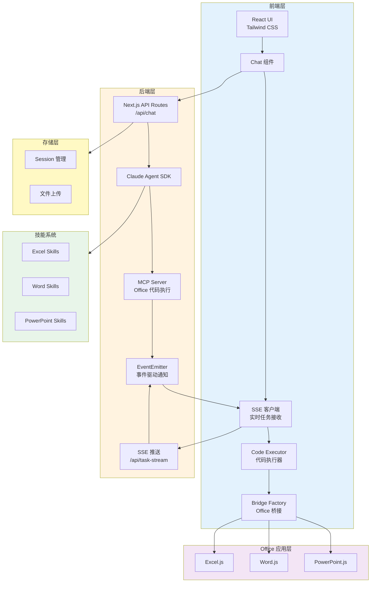

# DocuPilot

<div align="center">
**通过自然语言对话，让 Claude AI 智能助手帮你完成 Excel、Word、PowerPoint 的复杂操作**

[](https://opensource.org/licenses/MIT)
[](https://nodejs.org/)
[](https://nextjs.org/)
[](https://www.typescriptlang.org/)

简体中文 | [English](README_EN.md)

</div>

---

## 🎉 v2.0 重大更新

**领域聚合式MCP工具架构** - 性能提升52%，Token消耗降低65%！

- ✨ **10个领域工具 + 63个操作** - Excel/Word/PPT智能操作
- ⚡ **更快响应** - 从2.5s降至1.2s
- 🎯 **更高成功率** - 错误率从15%降至<5%
- 🔄 **完全向后兼容** - 现有代码继续工作

👉 [查看升级说明](./docs/MCP_TOOLS_UPGRADE_v2.0.md) | [完整API文档](./docs/MCP_TOOLS_API.md)

---

## 📸 项目截图

<div align="center">

### Excel 数据分析


### Word 文档编辑


### PowerPoint 演示文稿


</div>

---

## 📖 目录

- [✨ 核心特性](#-核心特性)
- [🎯 为什么选择 DocuPilot](#-为什么选择-docupilot)
- [🚀 快速开始](#-快速开始)
  - [前置要求](#前置要求)
  - [安装步骤](#安装步骤)
  - [在 Office 中加载](#在-office-中加载)
  - [首次使用](#首次使用)
- [💡 使用示例](#-使用示例)
  - [Excel 数据分析](#excel-数据分析)
  - [Word 文档编辑](#word-文档编辑)
  - [PowerPoint 演示文稿](#powerpoint-演示文稿)
  - [文件上传处理](#文件上传处理)
- [🏗️ 开发者指南](#️-开发者指南)
  - [项目架构](#项目架构)
  - [技术栈](#技术栈)
  - [项目结构](#项目结构)
  - [本地开发](#本地开发)
- [🔧 扩展与自定义](#-扩展与自定义)
  - [添加新技能](#添加新技能)
  - [自定义 Office 操作](#自定义-office-操作)
  - [API 配置选项](#api-配置选项)
- [🧪 测试](#-测试)
- [🤝 贡献指南](#-贡献指南)
- [❓ 常见问题](#-常见问题)
- [📄 许可证](#-许可证)

---

## ✨ 核心特性

### 🗣️ 自然语言操作 Office
无需记忆复杂的菜单和功能，**直接用对话完成工作**：
- "帮我分析这些销售数据的趋势"
- "在文档开头添加一个专业的标题页"
- "创建一个关于市场分析的 PPT"

### 🤖 Claude Agent 智能引擎
基于 **Claude 4.5 Sonnet** 的强大 AI 能力：
- 理解复杂的任务需求
- 自动拆解多步骤操作
- 高质量完成专业任务
- 上下文感知的智能对话

### 🎭 Agent/Plan 双模式
根据任务复杂度选择执行方式：
- **Agent 模式**：直接执行操作，实时反馈结果
- **Plan 模式**：先制定执行计划，确认后再执行

### 🔄 跨应用统一体验
一个插件，三大 Office 应用：
- ✅ **Excel**：数据分析、透视表、图表、条件格式
- ✅ **Word**：文档编辑、样式管理、搜索替换
- ✅ **PowerPoint**：幻灯片创建、内容排版、主题应用

### 🧩 技能系统可扩展
插件式架构，轻松扩展新功能：
- 基于 `.claude/skills/` 的模块化技能系统
- 每个技能独立定义、易于维护
- 支持自定义 Office.js 操作模板
- 社区可贡献新技能

### 🔧 MCP工具 v2.0
**领域聚合式架构**，提供10个高性能领域工具：
- **Excel**: `excel_range`, `excel_worksheet`, `excel_table`, `excel_chart`
- **Word**: `word_document`, `word_paragraph`, `word_table`
- **PowerPoint**: `ppt_slide`, `ppt_shape`, `ppt_table`
- **通用**: `execute_code` (复杂自定义操作)

**性能提升**: 响应速度↑52%，Token消耗↓65%，错误率↓67%  
👉 [查看完整API文档](./docs/MCP_TOOLS_API.md)

---

## 🎯 为什么选择 DocuPilot

| 传统方式 | DocuPilot |
|---------|-----------|
| 🔍 在菜单中查找功能 | 💬 直接说出需求 |
| 📖 学习复杂的公式和函数 | 🤖 AI 自动处理逻辑 |
| ⏰ 重复手动操作 | ⚡ 一句话批量完成 |
| 🤔 需要记忆操作步骤 | 🧠 AI 理解上下文自动执行 |
| 📱 单一应用单独学习 | 🔗 统一交互方式 |

---

## 🚀 快速开始

### 前置要求

- **Node.js** 18.0 或更高版本
- **Office 应用**：
  - Office 365 订阅版（推荐）
  - Office 2019 或更高版本
  - Office for Mac（2019 或更高版本）
- **Anthropic API Key**：从 [Anthropic Console](https://console.anthropic.com/) 获取

### 安装步骤

#### 方式 1：一键安装（推荐，macOS/Linux）

使用 curl 命令快速安装：

```bash
curl -fsSL https://raw.githubusercontent.com/docupilot/docupilot/main/scripts/install.sh | bash
```

该脚本会自动：
- ✅ 检查系统环境（git、Node.js、npm）
- ✅ 克隆项目仓库
- ✅ 安装依赖包
- ✅ 创建配置文件模板

**自定义安装选项**：

```bash
# 安装到指定目录
DOCUPILOT_DIR=~/my-docupilot curl -fsSL https://raw.githubusercontent.com/docupilot/docupilot/main/scripts/install.sh | bash

# 从特定分支安装
DOCUPILOT_BRANCH=develop curl -fsSL https://raw.githubusercontent.com/docupilot/docupilot/main/scripts/install.sh | bash

# 从 Fork 仓库安装
DOCUPILOT_REPO=https://github.com/YOUR_USERNAME/docupilot.git curl -fsSL https://raw.githubusercontent.com/docupilot/docupilot/main/scripts/install.sh | bash
```

#### 方式 2：手动安装（所有平台）

如果无法使用 curl 或希望手动控制每个步骤：

```bash
# 1. 克隆项目
git clone https://github.com/docupilot/docupilot.git
cd docupilot

# 2. 安装依赖
npm install

# 3. 配置 API Key
cp .env.local.example .env.local
# 编辑 .env.local 文件，填入你的 Anthropic API Key

# 4. 启动开发服务器（HTTPS）
npm run dev:https
```

服务器启动后，访问 `https://localhost:3000/taskpane` 验证是否正常运行。

### 在 Office 中加载

DocuPilot 提供两种加载方式，可根据您的平台和使用场景选择：

#### 方法 1：共享文件夹加载（推荐用于开发）

此方法将 `manifest.xml` 复制到系统特定目录，Office 会自动识别。

##### macOS 用户

1. **启动开发服务器**：
   
   ```bash
   npm run dev:https
   ```

2. **使用脚本自动安装**（推荐）：
   
   ```bash
   ./copy-manifest-to-wef.sh
   ```
   
   脚本将自动把 `manifest.xml` 复制到以下目录：
   - Excel: `~/Library/Containers/com.microsoft.Excel/Data/Documents/wef/`
   - Word: `~/Library/Containers/com.microsoft.Word/Data/Documents/wef/`
   - PowerPoint: `~/Library/Containers/com.microsoft.Powerpoint/Data/Documents/wef/`

3. **手动安装**（可选）：
   
   如果脚本无法运行，可手动复制：
   ```bash
   # Excel
   mkdir -p ~/Library/Containers/com.microsoft.Excel/Data/Documents/wef/
   cp manifest.xml ~/Library/Containers/com.microsoft.Excel/Data/Documents/wef/
   
   # Word
   mkdir -p ~/Library/Containers/com.microsoft.Word/Data/Documents/wef/
   cp manifest.xml ~/Library/Containers/com.microsoft.Word/Data/Documents/wef/
   
   # PowerPoint
   mkdir -p ~/Library/Containers/com.microsoft.Powerpoint/Data/Documents/wef/
   cp manifest.xml ~/Library/Containers/com.microsoft.Powerpoint/Data/Documents/wef/
   ```

4. **在 Office 中加载**：
   - 打开 Excel、Word 或 PowerPoint
   - 点击 **插入** 选项卡 → **获取加载项** 或 **我的加载项**
   - 选择 **共享文件夹** 选项卡
   - 找到并点击 **DocuPilot** 加载项

##### Windows 用户

1. **启动开发服务器**：
   
   ```bash
   npm run dev:https
   ```

2. **使用脚本自动安装**（推荐）：
   
   双击运行或在命令提示符中执行：
   ```batch
   copy-manifest-to-wef.bat
   ```
   
   脚本将自动把 `manifest.xml` 复制到：
   - `%USERPROFILE%\AppData\Local\Microsoft\Office\16.0\Wef\`
   
   > **注意**：如果使用 Office 2013，需修改脚本中的 `16.0` 为 `15.0`

3. **手动安装**（可选）：
   
   如果脚本无法运行，可手动复制：
   ```batch
   mkdir "%USERPROFILE%\AppData\Local\Microsoft\Office\16.0\Wef"
   copy manifest.xml "%USERPROFILE%\AppData\Local\Microsoft\Office\16.0\Wef\manifest.xml"
   ```

4. **在 Office 中加载**：
   - 打开 Excel、Word 或 PowerPoint
   - 点击 **插入** 选项卡 → **获取加载项** 或 **我的加载项**
   - 选择 **共享文件夹** 选项卡
   - 找到并点击 **DocuPilot** 加载项

#### 方法 2：手动上传加载（通用方法）

此方法适用于所有平台，无需脚本或文件复制。

1. **启动开发服务器**：
   
   ```bash
   npm run dev:https
   ```

2. **打开 Office 应用**（Excel、Word 或 PowerPoint）

3. **上传加载项**：
   - 点击 **插入** 选项卡
   - 选择 **获取加载项** 或 **我的加载项**
   - 点击 **上传我的加载项**
   - 浏览并选择项目根目录下的 `manifest.xml` 文件
   - 点击 **上传**

4. **打开 DocuPilot**：
   - 在功能区找到 **DocuPilot** 按钮
   - 点击按钮，任务窗格将在右侧打开

> 💡 **提示**：
> - 共享文件夹方法更便于开发，修改代码后无需重新上传
> - 手动上传方法更简单直接，适合快速测试
> - 如果加载项未显示，请重启 Office 应用

### HTTPS 证书配置（重要）

Office Add-in **必须使用 HTTPS**。在首次使用前，需要正确配置和信任本地开发证书。

#### 自动证书生成

首次运行 `npm run dev:https` 时，项目会自动使用 `office-addin-dev-certs` 生成自签名证书：

```bash
npm run dev:https

# 证书自动生成到：
# macOS/Linux: ~/.office-addin-dev-certs/
# Windows: %USERPROFILE%\.office-addin-dev-certs\
```

#### macOS 证书信任设置

**方法 1：命令行方式**（推荐，一步完成）

```bash
sudo security add-trusted-cert -d -r trustRoot -k /Library/Keychains/System.keychain ~/.office-addin-dev-certs/localhost.crt
```

**方法 2：图形界面方式**

```bash
# 打开证书目录
open ~/.office-addin-dev-certs

# 然后按以下步骤操作：
# 1. 双击 localhost.crt 文件
# 2. 在钥匙串访问中，找到"系统"钥匙串中的 "localhost"
# 3. 双击证书，展开"信任"部分
# 4. 将"使用此证书时"设置为"始终信任"
# 5. 关闭窗口，输入管理员密码确认
```

**验证**：

```bash
# 打开浏览器访问，应该没有证书警告
open https://localhost:3000/taskpane
```

#### Windows 证书信任设置

**方法 1：PowerShell 命令**（推荐，需要管理员权限）

```powershell
# 以管理员身份运行 PowerShell
$certPath = "$env:USERPROFILE\.office-addin-dev-certs\localhost.crt"
Import-Certificate -FilePath $certPath -CertStoreLocation Cert:\LocalMachine\Root
```

**方法 2：图形界面方式**

```
1. 打开证书目录：
   - 按 Win+R
   - 输入：%USERPROFILE%\.office-addin-dev-certs
   - 回车

2. 安装证书：
   - 双击 localhost.crt 文件
   - 点击"安装证书"
   - 选择"本地计算机"（需要管理员权限）
   - 选择"将所有的证书都放入下列存储"
   - 浏览 → 选择"受信任的根证书颁发机构"
   - 完成安装

3. 确认安装：
   - 按 Win+R，输入 certmgr.msc
   - 查看"受信任的根证书颁发机构" → "证书"
   - 应该能看到 "localhost" 证书
```

**验证**：

```bash
# 打开浏览器访问，应该没有证书警告
start https://localhost:3000/taskpane
```

#### 常见问题

**问题 1：浏览器仍显示证书警告**

- ✅ 确认证书已正确安装到系统信任库
- ✅ 完全重启浏览器（关闭所有窗口）
- ✅ 清除浏览器缓存和 SSL 状态

**问题 2：Office 无法加载加载项**
- ✅ 确认开发服务器正在运行（`npm run dev:https`）
- ✅ 重启 Office 应用程序
- ✅ 检查 Office 版本是否支持 Add-in

**问题 3：证书文件不存在**

```bash
# 手动安装证书工具
npx office-addin-dev-certs install

# 然后重新启动服务器
npm run dev:https
```

> ⚠️ **重要提示**：
> - 必须先信任证书，再在 Office 中加载加载项
> - 每次重新生成证书后，需要重新信任
> - 团队开发时，每个开发者需要在自己的机器上生成和信任证书

### 首次使用

1. **配置 API Key**（如果尚未在 .env.local 中配置）：
   - 点击任务窗格右上角的 ⚙️ 设置按钮
   - 输入你的 Anthropic API Key
   - 点击"保存"

2. **开始对话**：
   - 在输入框输入："你好，请介绍一下你自己"
   - 观察 Claude 的响应
   - 尝试简单命令："在 A1 单元格写入 Hello World"

3. **验证安装**：
   - 如果看到 Claude 的真实回复（而非模拟响应）
   - 且 Office 操作成功执行
   - 说明安装成功！🎉

---

## 💡 使用示例

### Excel 数据分析

**场景**：分析销售数据并创建可视化图表

```
你：帮我分析 A1:E20 区域的销售数据，按产品类别汇总，并创建一个柱状图
```

DocuPilot 将：
1. ✅ 读取指定区域的数据
2. ✅ 自动创建数据透视表
3. ✅ 按类别汇总销售额
4. ✅ 生成柱状图并设置格式
5. ✅ 告知你结果位置

**更多示例**：
- "在 B 列计算平均值"
- "找出销售额前 10 的产品并高亮显示"
- "创建一个包含季度趋势的折线图"
- "为这个表格添加条件格式，低于平均值的显示红色"

### Word 文档编辑

**场景**：快速创建专业文档结构

```
你：帮我创建一个项目报告模板，包含标题页、摘要、背景、方法、结果和结论这几个章节
```

DocuPilot 将：
1. ✅ 插入封面页
2. ✅ 创建各级标题
3. ✅ 应用专业样式
4. ✅ 添加页码和目录

**更多示例**：
- "在文档开头插入一个 3x4 的表格"
- "将所有'产品'替换为'解决方案'"
- "为文档添加页眉，内容为'公司机密'"
- "在选中的段落后插入一个注释"

### PowerPoint 演示文稿

**场景**：快速生成演示幻灯片

```
你：创建一个关于产品发布的演示，包含封面、产品特性、市场优势、价格方案和联系方式
```

DocuPilot 将：
1. ✅ 创建多张幻灯片
2. ✅ 设置标题和内容布局
3. ✅ 应用统一主题
4. ✅ 添加形状和图标

**更多示例**：
- "在当前幻灯片添加一个标题和三栏内容"
- "插入一张新幻灯片，标题为'市场分析'"
- "在幻灯片中添加一个流程图"
- "为所有标题应用公司品牌颜色"

### 文件上传处理

**场景**：上传 CSV 文件并分析

1. **上传文件**：
   - 点击输入框旁的 📎 按钮
   - 选择 CSV 或 Excel 文件

2. **请求分析**：
   ```
   你：分析我上传的销售数据文件，给出关键指标和趋势
   ```

3. DocuPilot 将：
   - ✅ 读取文件内容
   - ✅ 执行数据分析
   - ✅ 生成分析报告
   - ✅ 保存结果到 workspace 目录

---

## 🏗️ 开发者指南

### 项目架构



**核心工作流程**：

1. **用户输入** → React 聊天界面 (`Chat` 组件)
2. **发送请求** → Next.js API Route (`/api/chat`)
3. **调用 SDK** → Claude Agent SDK 处理用户请求
4. **MCP Tool 调用** → Agent 调用 `mcp__office__execute_code` 工具
5. **任务入队** → MCP Server 将任务放入待执行队列
6. **SSE 推送** → 通过 `/api/task-stream` 实时推送到前端（零延迟）
7. **代码执行** → 前端 `Code Executor` 接收任务并执行 Office.js 代码
8. **Bridge 路由** → `Bridge Factory` 根据 Office 类型路由到对应实现
9. **结果反馈** → 执行结果通过 `EventEmitter` 事件驱动通知后端（< 1ms）
10. **自动修复** → 如果执行失败，Agent 根据错误信息自动修正代码并重试（最多 3 次）
11. **流式响应** → 最终结果通过 SSE 流式返回给用户

**性能优化亮点**：

- ⚡ **事件驱动架构**：使用 EventEmitter 替代轮询，响应延迟从 50ms 降至 < 1ms（**72 倍加速**）
- 🚀 **SSE 实时推送**：任务产生时立即推送，无需前端轮询（**100 倍加速**）
- 🔄 **自动错误修复**：智能识别错误模式，自动重试修正（最多 3 次）
- 📦 **桥接模式**：统一的 Office 操作接口，支持 Excel/Word/PowerPoint

### 技术栈

#### 前端
- **框架**：Next.js 15 (App Router)
- **UI 库**：React 18
- **样式**：Tailwind CSS 4
- **组件库**：Radix UI
- **图标**：Lucide React
- **Markdown**：react-markdown + remark-gfm
- **Office 集成**：Office.js

#### 后端
- **运行时**：Node.js 18+
- **API**：Next.js API Routes
- **AI 引擎**：@anthropic-ai/claude-agent-sdk
- **类型检查**：TypeScript 5.7

#### 开发工具
- **包管理器**：npm
- **证书生成**：office-addin-dev-certs
- **HTTPS 服务器**：自定义 Express 服务器 (server.mjs)

### 项目结构

```
DocuPilot/
├── .claude/                    # Claude 技能系统
│   ├── CLAUDE.md              # 系统提示词
│   └── skills/
│       ├── excel/             # Excel 技能
│       │   ├── SKILL.md       # 技能定义
│       │   └── TOOLS.md       # 代码模板
│       ├── word/              # Word 技能
│       └── powerpoint/        # PowerPoint 技能
├── src/
│   ├── app/
│   │   ├── api/               # API 路由
│   │   │   ├── chat/          # 聊天 API（Claude Agent SDK）
│   │   │   ├── task-stream/    # SSE 任务推送
│   │   │   ├── tool-result/   # 工具执行结果提交
│   │   │   ├── files/         # 文件上传
│   │   │   └── settings/      # 设置 API
│   │   ├── taskpane/          # 任务窗格页面
│   │   └── test-office/       # 测试页面
│   ├── components/            # React 组件
│   │   ├── ChatInput.tsx      # 聊天输入
│   │   ├── MessageBubble.tsx  # 消息气泡
│   │   ├── SettingsDialog.tsx # 设置对话框
│   │   └── ui/                # UI 基础组件
│   ├── lib/
│   │   ├── office/            # Office.js 封装
│   │   │   ├── mcp-server.ts  # MCP Server（Office 代码执行）
│   │   │   ├── bridge-factory.ts # Bridge 工厂（Excel/Word/PPT）
│   │   │   ├── code-executor.ts # 代码执行器
│   │   │   ├── error-patterns.ts # 错误模式识别
│   │   │   ├── error-feedback-builder.ts # 错误反馈构建
│   │   │   ├── tools.ts       # 工具定义
│   │   │   └── host-detector.ts # 宿主检测
│   │   └── use-chat.ts        # 聊天 Hook（SSE 集成）
│   └── types/                 # TypeScript 类型定义
├── public/
│   ├── assets/                # 项目截图和资源
│   │   ├── sample_excel.png   # Excel 界面截图
│   │   ├── sample_word.png    # Word 界面截图
│   │   └── sample_ppt.png     # PowerPoint 界面截图
│   ├── commands.html          # Office 命令
│   └── test-cases/            # 测试用例
├── tests/
│   └── office-skills/         # 技能测试系统
├── workspace/
│   └── sessions/              # 用户会话数据
├── manifest.xml               # Office Add-in 配置
├── server.mjs                 # HTTPS 开发服务器
└── package.json
```

### 本地开发

#### 开发命令

```bash
# HTTP 开发服务器（仅用于浏览器测试）
npm run dev

# HTTPS 开发服务器（Office Add-in 必需）
npm run dev:https

# 构建生产版本
npm run build

# 启动生产服务器
npm start

# 代码检查
npm run lint
```

#### 环境变量配置

创建 `.env.local` 文件：

```env
# 必需：Anthropic API Key
ANTHROPIC_API_KEY=sk-ant-...

# 可选：自定义 API 基础 URL（用于代理或企业部署）
# ANTHROPIC_BASE_URL=https://your-proxy.com

# 可选：指定模型名称
# ANTHROPIC_MODEL=claude-sonnet-4-5-20250929

# 可选：清理端点的 API Key（安全措施）
# CLEANUP_API_KEY=your_secret_key
```

#### HTTPS 证书生成

Office Add-in 要求使用 HTTPS。项目会自动生成自签名证书：

```bash
# 首次运行时自动生成
npm run dev:https

# 证书位置：~/.office-addin-dev-certs/
```

**macOS 信任证书**：

```bash
# 在 Keychain Access 中将证书设置为"始终信任"
# 或运行以下命令
sudo security add-trusted-cert -d -r trustRoot -k /Library/Keychains/System.keychain ~/.office-addin-dev-certs/localhost.crt
```

#### 调试技巧

1. **浏览器调试**：
   - 在浏览器中打开 `https://localhost:3000/taskpane`
   - 使用浏览器开发者工具查看日志和网络请求

2. **Office 内调试**：
   - **Windows**: 按 F12 打开调试工具
   - **Mac**: 在 Safari 中启用开发者菜单，选择对应的网页检查器

3. **后端日志**：
   - 查看终端中的 Next.js 服务器日志
   - API 错误会显示在终端

4. **测试模式**：
   - 访问 `https://localhost:3000/test-office`
   - 使用测试面板验证技能功能

---

## 🔧 扩展与自定义

### 添加新技能

DocuPilot 使用模块化的技能系统，你可以轻松添加新的 Office 操作技能。

#### 步骤 1：创建技能目录

```bash
mkdir -p .claude/skills/my-skill
```

#### 步骤 2：创建 SKILL.md

在 `.claude/skills/my-skill/SKILL.md` 中定义技能：

```markdown
---
name: my-skill
description: 我的自定义技能描述
---

# 我的技能

## 使用方式

通过生成隐藏的 Office.js 代码来操作 Office 应用。

### 重要规则

- 用户体验至上：用户只看到自然语言
- 隐藏代码格式：`<!--OFFICE-CODE:excel\n代码\n-->`
- 友好反馈：操作完成后告知用户结果

## 支持的功能

- 功能 1：描述
- 功能 2：描述

## 示例

### 示例 1：功能演示

**用户请求**："做某件事"

**你的回复**：
\`\`\`
好的，我来帮你处理。

<!--OFFICE-CODE:excel
Excel.run(async (context) => {
  // 你的代码
  await context.sync();
});
-->

✅ 操作完成！
\`\`\`
```

#### 步骤 3：创建 TOOLS.md（可选）

在 `.claude/skills/my-skill/TOOLS.md` 中提供代码模板：

```markdown
# 操作模板

## 模板 1

\`\`\`javascript
Excel.run(async (context) => {
  const sheet = context.workbook.worksheets.getActiveWorksheet();
  // 模板代码
  await context.sync();
});
\`\`\`
```

#### 步骤 4：更新系统提示（可选）

如果需要在 `.claude/CLAUDE.md` 中引用新技能，添加相应说明。

### 自定义 Office 操作

#### 修改工具定义

编辑 `src/lib/office/tools.ts` 添加新的工具：

```typescript
export const getToolsForHost = (hostType: OfficeHostType) => {
  const commonTools = [
    // 通用工具
  ];

  const hostSpecificTools = {
    Excel: [
      // Excel 特定工具
      {
        name: "my_custom_tool",
        description: "我的自定义工具",
        input_schema: {
          type: "object",
          properties: {
            // 参数定义
          },
          required: []
        }
      }
    ],
    // ...
  };

  return [...commonTools, ...hostSpecificTools[hostType]];
};
```

#### 添加工具处理逻辑

在 Claude 的响应中，根据工具名称执行相应操作。由于使用 Claude Agent SDK，工具调用是自动处理的。

### API 配置选项

#### 方式 1：前端设置界面（推荐）

1. 点击任务窗格右上角的 ⚙️ 按钮
2. 填写 API 配置
3. 点击保存

**优点**：

- ✅ 无需重启应用
- ✅ 立即生效
- ✅ 便于切换不同配置

**安全提示**：配置保存在浏览器 localStorage，不建议在公共设备上使用。

#### 方式 2：环境变量（适合开发/部署）

编辑 `.env.local`：

```env
ANTHROPIC_API_KEY=your_key_here
ANTHROPIC_BASE_URL=https://your-proxy.com  # 可选
ANTHROPIC_MODEL=claude-sonnet-4-5-20250929  # 可选
```

**优点**：
- ✅ 配置与代码分离
- ✅ 适合团队开发
- ✅ 更安全

#### 配置优先级

```
前端设置 > .env.local > 系统环境变量
```

#### 代理/企业部署

如果你的网络环境需要通过代理访问 Anthropic API：

1. **配置代理 URL**：
   ```env
   ANTHROPIC_BASE_URL=https://your-proxy.com/v1
   ```

2. **确保代理兼容**：
   - 代理必须转发标准的 Anthropic API 请求
   - 保持 API 响应格式不变

3. **测试连接**：
   - 发送测试消息验证配置

---

## 🧪 测试

### Office Skills 测试系统

DocuPilot 提供了完整的技能测试框架，位于 `tests/office-skills/` 目录。

#### 访问测试面板

```bash
# 启动开发服务器
npm run dev:https

# 在浏览器中访问
https://localhost:3000/test-office
```

#### 测试面板功能

- ✅ 选择应用类型（Excel/Word/PowerPoint）
- ✅ 加载对应的测试用例
- ✅ 一键执行单个或批量测试
- ✅ 实时查看测试结果
- ✅ 导出错误报告

#### 测试用例格式

测试用例位于 `public/test-cases/` 目录：

```json
{
  "id": "test-001",
  "name": "测试名称",
  "description": "测试描述",
  "category": "分类",
  "prompt": "发送给 AI 的提示词",
  "expectedBehavior": "预期行为描述"
}
```

#### 创建新测试用例

1. 编辑对应的测试用例文件：
   - `public/test-cases/excel-test-cases.json`
   - `public/test-cases/word-test-cases.json`
   - `public/test-cases/powerpoint-test-cases.json`

2. 添加新的测试对象

3. 在测试面板中运行

详细文档：[tests/office-skills/README.md](tests/office-skills/README.md)

---

## 🤝 贡献指南

我们欢迎所有形式的贡献！无论是新功能、Bug 修复、文档改进还是新技能。

### 如何贡献

1. **Fork 项目**
   ```bash
   # 点击 GitHub 页面右上角的 Fork 按钮
   ```

2. **克隆你的 Fork**
   ```bash
   git clone https://github.com/YOUR_USERNAME/docupilot.git
   cd docupilot
   ```

3. **创建特性分支**
   ```bash
   git checkout -b feature/my-new-feature
   # 或
   git checkout -b fix/bug-description
   ```

4. **进行修改**
   - 编写代码
   - 添加测试
   - 更新文档

5. **提交修改**
   ```bash
   git add .
   git commit -m "feat: 添加新功能描述"
   # 或
   git commit -m "fix: 修复某个问题"
   ```

6. **推送到 GitHub**
   ```bash
   git push origin feature/my-new-feature
   ```

7. **创建 Pull Request**
   - 访问你的 Fork 页面
   - 点击 "New Pull Request"
   - 填写 PR 描述
   - 提交

### 贡献类型

#### 🎯 新技能

贡献一个新的 Office 操作技能：
1. 在 `.claude/skills/` 下创建新目录
2. 编写 `SKILL.md` 和 `TOOLS.md`
3. 添加测试用例
4. 提交 PR，说明技能的用途和使用方法

#### 🐛 Bug 修复

发现 Bug？帮我们修复：
1. 在 Issues 中搜索是否已有相关报告
2. 如果没有，创建新 Issue 描述问题
3. Fork 并修复
4. 提交 PR 并关联 Issue

#### 📚 文档改进

文档永远可以更好：
- 修正错误或不清晰的描述
- 添加使用示例
- 翻译成其他语言
- 改进 README 或其他文档

#### ✨ 新功能

想要添加新功能？
1. 先在 Issues 中讨论你的想法
2. 获得反馈后开始开发
3. 确保添加相应的测试
4. 更新相关文档
5. 提交 PR

### 代码规范

- **TypeScript**：使用严格模式，提供类型定义
- **命名**：使用有意义的变量和函数名
- **注释**：为复杂逻辑添加注释
- **格式**：运行 `npm run lint` 检查代码风格

### Commit 规范

使用语义化的 commit 消息：

```
feat: 添加新功能
fix: 修复 Bug
docs: 文档更新
style: 代码格式调整
refactor: 代码重构
test: 测试相关
chore: 构建/工具相关
```

### 行为准则

- 尊重所有贡献者
- 欢迎新手提问
- 建设性地提供反馈
- 保持友好和专业

---

## ❓ 常见问题

### 安装与配置

#### Q0: 一键安装脚本失败？

**A**: curl 安装方式的常见问题：

1. **网络问题**：
   ```bash
   # 如果无法访问 GitHub，可以尝试：
   # 1. 使用代理
   # 2. 手动下载脚本后执行
   wget https://raw.githubusercontent.com/docupilot/docupilot/main/scripts/install.sh
   bash install.sh
   ```

2. **权限问题**：
   ```bash
   # 如果提示权限不足，使用完整路径
   DOCUPILOT_DIR=$HOME/docupilot curl -fsSL https://raw.githubusercontent.com/docupilot/docupilot/main/scripts/install.sh | bash
   ```

3. **Node.js 版本问题**：
   ```bash
   # 检查 Node.js 版本
   node -v
   
   # 如果版本低于 18.0.0，请升级
   # macOS (使用 Homebrew)
   brew install node@20
   
   # Linux (使用 nvm)
   nvm install 20
   nvm use 20
   ```

4. **目录已存在**：
   ```bash
   # 删除现有目录重新安装
   rm -rf ./docupilot
   curl -fsSL https://raw.githubusercontent.com/docupilot/docupilot/main/scripts/install.sh | bash
   
   # 或安装到其他目录
   DOCUPILOT_DIR=./docupilot-new curl -fsSL https://raw.githubusercontent.com/docupilot/docupilot/main/scripts/install.sh | bash
   ```

5. **Windows 用户**：
   一键安装脚本仅支持 macOS/Linux。Windows 用户请使用手动安装方式：
   ```bash
   git clone https://github.com/docupilot/docupilot.git
   cd docupilot
   npm install
   ```

#### Q1: API Key 配置后不生效？

**A**: 检查以下几点：
1. ✅ API Key 格式正确（以 `sk-ant-` 开头）
2. ✅ `.env.local` 文件在项目根目录
3. ✅ 重启开发服务器（修改 .env.local 后需要）
4. ✅ 如果使用前端设置，确保点击了"保存"按钮

#### Q2: Office Add-in 加载失败？

**A**: 常见原因：
1. **证书问题**：
   - 确保信任了自签名证书
   - macOS: 在 Keychain Access 中设置为"始终信任"
   - Windows: 按提示信任证书

2. **manifest.xml 路径错误**：
   - 确保文件在项目根目录
   - 检查 XML 格式是否正确

3. **服务器未启动**：
   - 运行 `npm run dev:https`
   - 确保 https://localhost:3000 可访问

#### Q3: HTTPS 证书错误？

**A**: Office Add-in 必须使用 HTTPS。以下是完整的证书问题解决方案：

**常见错误症状**：
- ❌ 浏览器显示"您的连接不是私密连接"
- ❌ Office 显示"无法加载加载项"
- ❌ 控制台错误：`ERR_CERT_AUTHORITY_INVALID`
- ❌ 服务器启动失败：`ENOENT: no such file or directory`

**解决方案 - macOS**：

1. **自动生成证书**（首次运行）：
   ```bash
   npm run dev:https
   ```
   
   项目使用 `office-addin-dev-certs` 自动生成证书到：
   - `~/.office-addin-dev-certs/localhost.crt`（证书文件）
   - `~/.office-addin-dev-certs/localhost.key`（私钥文件）

2. **信任证书**（关键步骤）：
   
   方法 A - 使用命令行（推荐）：
   ```bash
   sudo security add-trusted-cert -d -r trustRoot -k /Library/Keychains/System.keychain ~/.office-addin-dev-certs/localhost.crt
   ```
   
   方法 B - 使用钥匙串访问：
   ```bash
   # 1. 打开钥匙串访问应用
   open /Applications/Utilities/Keychain\ Access.app
   
   # 2. 或者直接打开证书所在目录
   open ~/.office-addin-dev-certs
   
   # 3. 双击 localhost.crt 文件导入到钥匙串
   # 4. 在"系统"钥匙串中找到 "localhost"
   # 5. 双击打开，展开"信任"部分
   # 6. 将"使用此证书时"设置为"始终信任"
   # 7. 关闭窗口并输入管理员密码
   ```

3. **重启浏览器和 Office**：
   信任证书后，需要完全重启浏览器和 Office 应用。

4. **验证证书**：
   ```bash
   # 在浏览器中打开
   open https://localhost:3000/taskpane
   
   # 应该看到正常的页面，而不是证书警告
   ```

**解决方案 - Windows**：

1. **自动生成证书**（首次运行）：
   ```bash
   npm run dev:https
   ```
   
   证书将生成到：
   - `%USERPROFILE%\.office-addin-dev-certs\localhost.crt`
   - `%USERPROFILE%\.office-addin-dev-certs\localhost.key`

2. **信任证书**（关键步骤）：
   
   方法 A - 使用命令行（需要管理员权限）：
   ```powershell
   # 在 PowerShell（管理员）中运行
   $certPath = "$env:USERPROFILE\.office-addin-dev-certs\localhost.crt"
   Import-Certificate -FilePath $certPath -CertStoreLocation Cert:\LocalMachine\Root
   ```
   
   方法 B - 使用图形界面：
   ```
   1. 打开证书文件：
      - 按 Win+R，输入 %USERPROFILE%\.office-addin-dev-certs
      - 双击 localhost.crt 文件
   
   2. 安装证书：
      - 点击"安装证书"
      - 选择"本地计算机"（需要管理员权限）
      - 点击"下一步"
      - 选择"将所有的证书都放入下列存储"
      - 点击"浏览"，选择"受信任的根证书颁发机构"
      - 点击"确定" → "下一步" → "完成"
      - 出现安全警告，点击"是"
   
   3. 验证安装：
      - 按 Win+R，输入 certmgr.msc
      - 展开"受信任的根证书颁发机构" → "证书"
      - 查找 "localhost" 证书
   ```

3. **重启浏览器和 Office**：
   安装证书后，必须重启所有浏览器和 Office 应用。

4. **验证证书**：
   ```bash
   # 在浏览器中打开
   start https://localhost:3000/taskpane
   
   # 应该看到正常的页面，而不是证书警告
   ```

**证书问题排查**：

如果上述方法无效，尝试以下步骤：

1. **完全清理并重新生成证书**：
   ```bash
   # macOS/Linux
   rm -rf ~/.office-addin-dev-certs
   
   # Windows PowerShell
   Remove-Item -Recurse -Force "$env:USERPROFILE\.office-addin-dev-certs"
   
   # 重新生成
   npm run dev:https
   ```

2. **检查端口占用**：
   ```bash
   # macOS/Linux
   lsof -i :3000
   
   # Windows
   netstat -ano | findstr :3000
   
   # 如果端口被占用，关闭占用进程或修改 server.mjs 中的端口
   ```

3. **手动安装 office-addin-dev-certs**（如果自动生成失败）：
   ```bash
   npx office-addin-dev-certs install
   ```

4. **浏览器临时绕过（仅用于测试）**：
   - Chrome: 在警告页面输入 `thisisunsafe`（不显示）
   - Firefox: 点击"高级" → "接受风险并继续"
   - Safari: 点击"显示详细信息" → "访问此网站"
   
   ⚠️ **注意**：这只能解决浏览器访问问题，Office 加载项仍需要正确信任证书。

5. **防火墙/杀毒软件检查**：
   某些安全软件可能阻止本地证书。临时禁用后重试。

**最佳实践**：
- ✅ 开发期间保持证书文件不变
- ✅ 团队成员各自生成和信任自己的证书
- ✅ 不要将证书文件提交到 Git 仓库
- ✅ 生产环境使用正式的 SSL 证书

### 使用问题

#### Q4: AI 响应很慢或超时？

**A**: 可能原因：
1. **网络问题**：
   - 检查网络连接
   - 如在国内，考虑配置代理
   - 使用 `ANTHROPIC_BASE_URL` 设置代理

2. **复杂任务**：
   - 某些任务需要更长时间
   - 切换到 Plan 模式查看执行计划

3. **API 配额**：
   - 检查 Anthropic 账户配额

#### Q5: Office 操作没有执行？

**A**: 调试步骤：
1. **查看浏览器控制台**：
   - 检查是否有 JavaScript 错误
   - 查看是否有 Office.js API 错误

2. **检查隐藏代码**：
   - AI 的响应中应包含 `<!--OFFICE-CODE:...-->` 注释
   - 如果没有，说明 AI 没有正确生成代码

3. **权限问题**：
   - 确保 Office 文档已保存
   - 某些操作需要特定权限

#### Q6: 上传的文件找不到？

**A**: 文件管理说明：
- 文件位置：`workspace/sessions/{session_id}/uploads/`
- 文件名包含时间戳前缀：`1234567890_filename.xlsx`
- 使用通配符查找：`workspace/sessions/*/uploads/*.xlsx`
- 临时文件会在 1 小时后自动清理

### 开发问题

#### Q7: 如何调试技能代码？

**A**: 调试方法：
1. **测试面板**：
   - 访问 `https://localhost:3000/test-office`
   - 逐个测试技能功能

2. **浏览器调试**：
   - 打开浏览器开发者工具
   - 查看 Network 和 Console

3. **日志输出**：
   - 在技能代码中添加 `console.log()`
   - 查看浏览器控制台输出

#### Q8: 如何添加新的 Office.js API？

**A**: 步骤：
1. 查阅 [Office.js 文档](https://docs.microsoft.com/office/dev/add-ins/)
2. 在对应技能的 `TOOLS.md` 中添加模板
3. 在 `SKILL.md` 中添加使用说明
4. 创建测试用例验证

### 性能优化

#### Q9: 如何提升响应速度？

**A**: 优化建议：
1. **使用更快的模型**（如果 API 支持）
2. **简化提示词**：清晰、简短的需求
3. **批量操作**：一次性完成多个操作
4. **本地缓存**：重复任务使用历史记录

#### Q10: 大文件处理卡顿？

**A**: 解决方案：
1. **分批处理**：将大数据集拆分处理
2. **限制范围**：只处理必要的数据
3. **使用筛选**：先筛选再处理
4. **异步操作**：避免阻塞 UI

---

## 📄 许可证

本项目采用 [MIT License](LICENSE) 开源许可证。

```
MIT License

Copyright (c) 2026 DocuPilotAI

Permission is hereby granted, free of charge, to any person obtaining a copy
of this software and associated documentation files (the "Software"), to deal
in the Software without restriction...
```

这意味着你可以：
- ✅ 自由使用
- ✅ 修改代码
- ✅ 商业使用
- ✅ 分发副本

---

## 🔗 相关链接

- 📚 **完整文档**：[doc/](doc/)
- 🐛 **报告问题**：[GitHub Issues](https://github.com/docupilot/docupilot/issues)
- 💬 **讨论交流**：[GitHub Discussions](https://github.com/docupilot/docupilot/discussions)
- 🌟 **Star 项目**：如果觉得有用，请给我们一个 Star！

### 文档索引

- [快速启动指南](doc/QUICK_START.md)
- [用户使用指南](doc/USER_GUIDE.md)
- [测试系统文档](tests/office-skills/README.md)
- [API 配置说明](doc/API_KEY_SETUP.md)
- [故障排除指南](doc/TROUBLESHOOTING.md)

---

<div align="center">
用自然语言，让 AI 帮你高效完成 Office 工作！


Made with ❤️ by DocuPilotAI

[⬆ 回到顶部](#docupilot)

</div>
